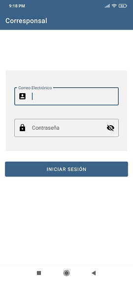
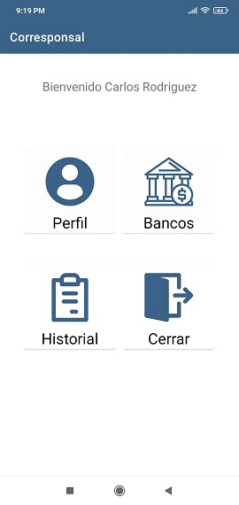
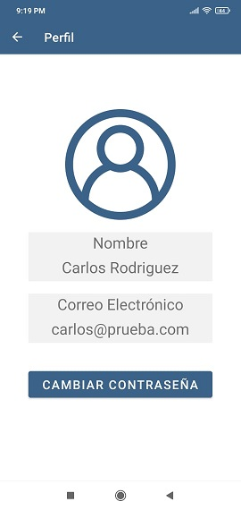
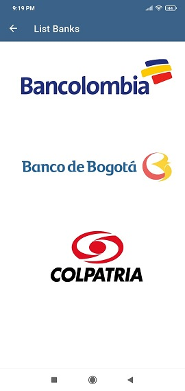
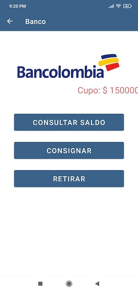
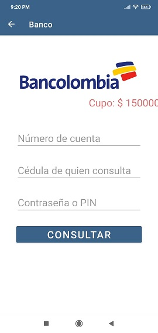
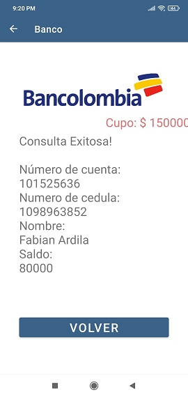

# Corresponsal
Corresponsal bancario con transacciones básicas (consulta, consignación, retiro), implementando recycler y fragments

Esta aplicación permite realizar transacciones sencillas como consultas de saldo, retiros de dinero o consignaciones, todas dentro de un mismo activity implementando fragments, tambien registra el historial de todas las transacciones

Todos los datos de usuarios, bancos y clientes se manejaron con un Json
https://pruebaswposs.000webhostapp.com/BancosEjercicio.json

